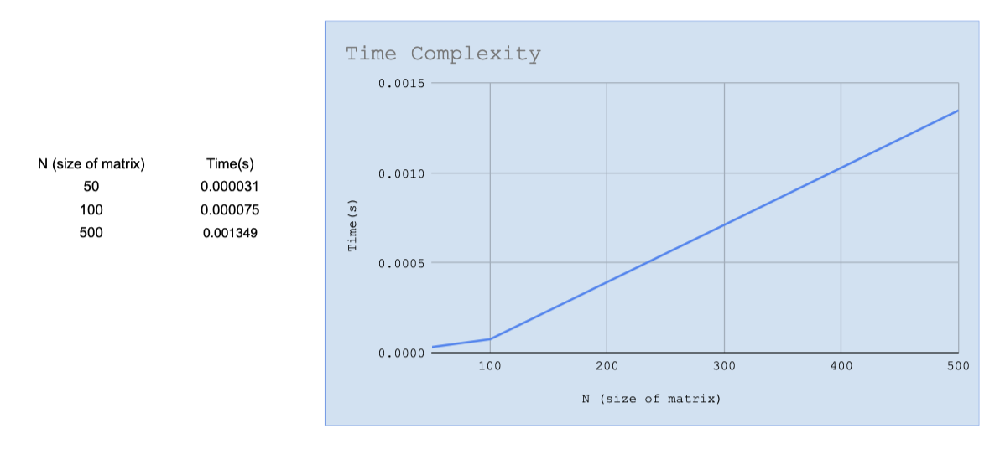
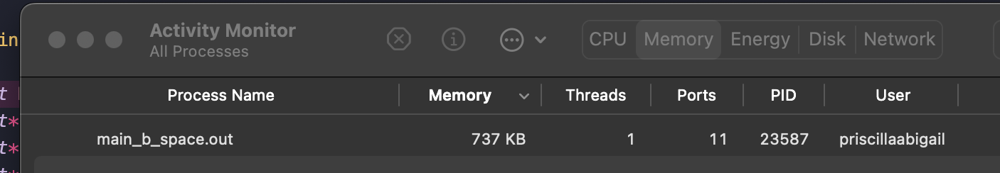
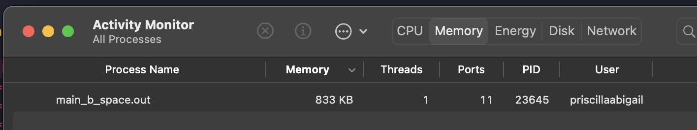
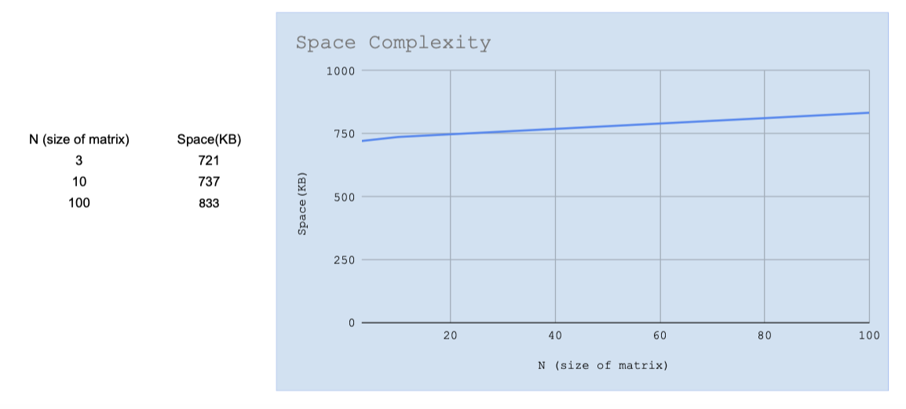

# <b> Matrix Vector Multiplication Benchmark </b>


This repository contains programs that: <br>
a. tests if the function used to calculate the matrix vector multiplication works successfully <br>
b. Analyzes the time and complexity of the matrix vector multiplication 


## Testing

To run:
```sh
make test
```

Output:
```
Test #1:
Actual V[0] = 43; Expected V[0] = 43
Actual V[1] = 24; Expected V[1] = 24

Test #2:
Actual V[0] = 72; Expected V[0] = 72
Actual V[1] = 120; Expected V[1] = 120

Test #3:
Actual V[0] = 40; Expected V[0] = 40
Actual V[1] = 46; Expected V[1] = 46
```
As you can see, the expected and the actual output is the same. That means that the testing function works and the function used is successful.


## Benchmark; time complexity


Run:
```sh
make time
```
Output: 
<br>
n = 50
```
Time elapsed: 0.000031 s
```
n = 100
```
Time elapsed: 0.000075 s
```
n = 500
```
Time elapsed: 0.001349 s
```
As you can see, the time takes to complete running the program increases as the value of N increases as well. That data is visualized using this graph:



## Benchmark; space complexity
Run:
```sh
make space
```
Output:
<br>
n = 3

n = 10

n = 100


As you can see, the space it takes while running the program also increases as the value of N increases. That data is also visualized using a graph:





